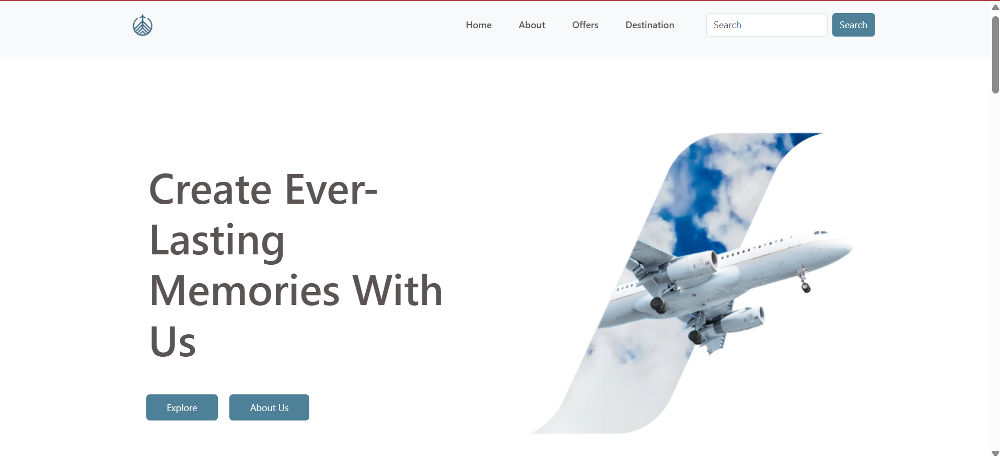
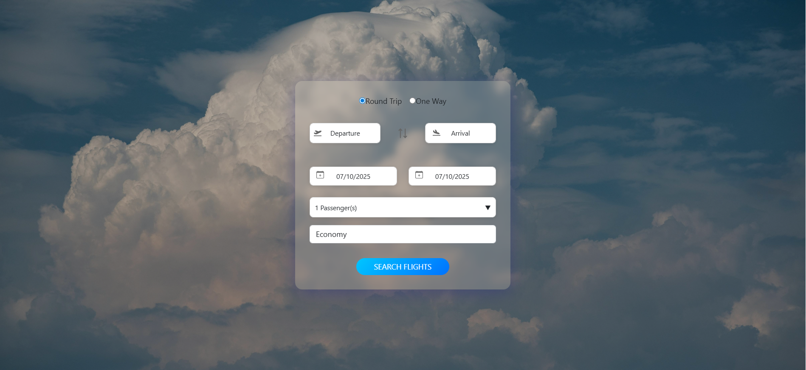
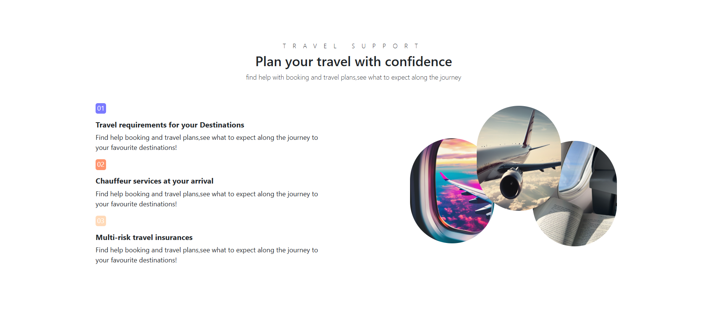
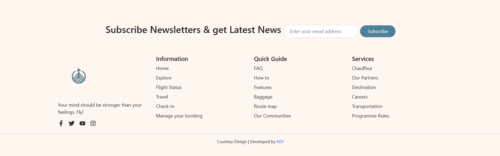

# ✈️ Dreams Airways – Flight Booking App

**Dreams Airways** is a modern full-stack flight booking web application that enables users to search for available flights, select preferences such as cabin class and number of passengers, and confirm bookings. Built with the MERN stack (MongoDB, Express, React, Node.js), the app provides a seamless and interactive booking experience, including confirmation PDFs and optional notifications.

---

## 📸 Preview

>
>
>
>
>

## 📦 Tech Stack

**Frontend:**

- React.js (with React Router)
- Tailwind CSS / Custom CSS
- EmailJS for contact form
- jsPDF for booking confirmation

**Backend:**

- Node.js + Express.js
- MongoDB (Atlas)
- Mongoose ODM
- dotenv for config

---

## ✨ Features

- 🔎 **Search Flights** based on departure, arrival, cabin class, passengers, and date
- ✅ **Real-time flight listing** after search
- 🧾 **Booking confirmation modal** with printable PDF generation
- 📩 **EmailJS-powered contact form** (users can send feedback)
- 📱 **Mobile responsive** and intuitive design
- 🔐 **Secure backend** with MongoDB validation and REST API structure

---

## 🚀 Getting Started

### ⚖️ Prerequisites

- Node.js (v14+)
- MongoDB Atlas account (or local MongoDB)
- EmailJS account (for contact form)

### 📅 Clone the Repository

```bash
git clone https://github.com/your-username/dreams-airways.git
cd dreams-airways
```

### 🔠 Run Frontend

```bash
cd flight-app-client
npm install
npm start
```

### ⚙️ Run Backend

```bash
cd flight-app-server
npm install
npm run dev
```

> Make sure `.env` in backend has your MongoDB URI and port configured.

---

## ⚙️ Configuration

### `.env` file (backend)

```env
PORT=5000
MONGO_URI=mongodb+srv://<username>:<password>@cluster0.mongodb.net/dreamsAirways
```

### EmailJS Setup (frontend)

Replace placeholders in `emailjs.send(...)`:

```js
emailjs.send(
  'your_service_id',
  'your_template_id',
  {
    from_name: form.name,
    from_email: form.email,
    message: form.message,
  },
  'your_user_or_public_key'
);
```

---

## 📁 Project Structure

```bash
flight-app-client/
🔁
├── Components/
│   ├── Booking.jsx
│   ├── FlightList.jsx
│   ├── ConfirmationModal.jsx
│   ├── Contact.jsx
│   └── ...
│
├── App.js
└── index.js

flight-app-server/
🔁
├── routes/
│   └── bookings.js
├── models/
│   └── Booking.js
├── controllers/
├── server.js
└── .env
```

---

## 📁 How It Works

1. User selects flight criteria in the **Booking** component.
2. On clicking **Search Flights**, the frontend sends a request to the backend for matching flights.
3. Matching flights are displayed in the **FlightList** component.
4. User books a flight, which opens a **confirmation modal**.
5. On confirmation, a **PDF ticket is generated** and the data is saved to MongoDB.
6. Optionally, a success message/email/SMS is sent.

---

## ✅ Future Enhancements

- 🧾 Integrate Razorpay/Stripe for payment handling
- 📧 Email confirmation with PDF attached
- 📱 PWA support for offline access
- ✈️ Admin panel for flight management

---

## 👥 Contributing

Pull requests are welcome! For major changes, please open an issue first to discuss.

---

## 👨‍💻 Author

**Mohammed Nusaif**\
📩 [nsf.ibn.sathar@gmail.com](mailto\:nsf.ibn.sathar@gmail.com)\
🔗 [GitHub](https://github.com/Mohammed-Nusaif)

---

## 🧫 License

This project is licensed under the [MIT License](LICENSE).

---

